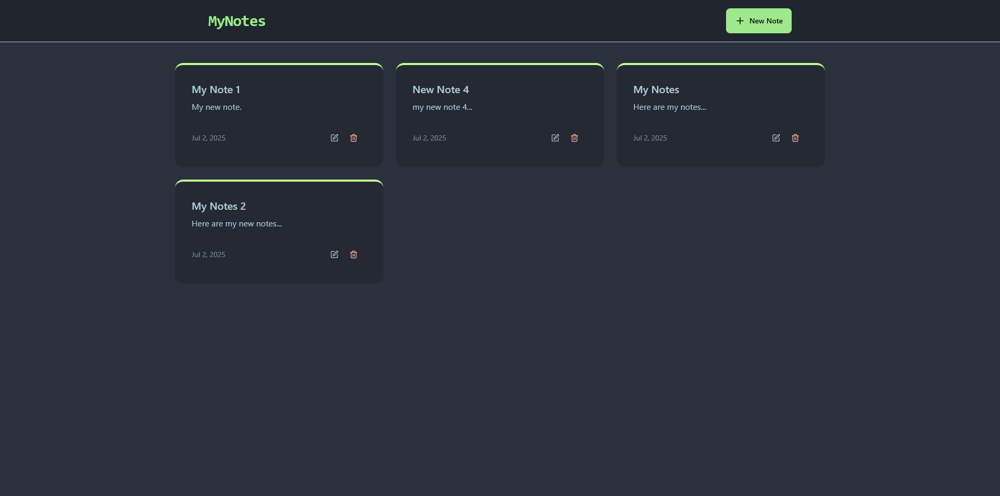
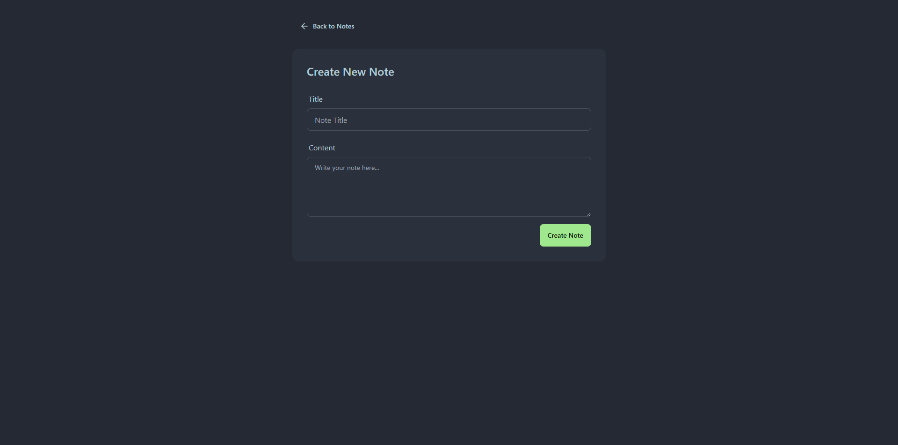
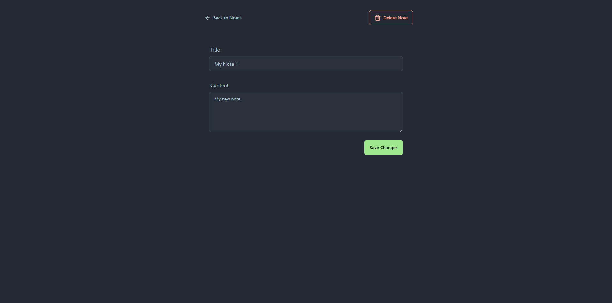
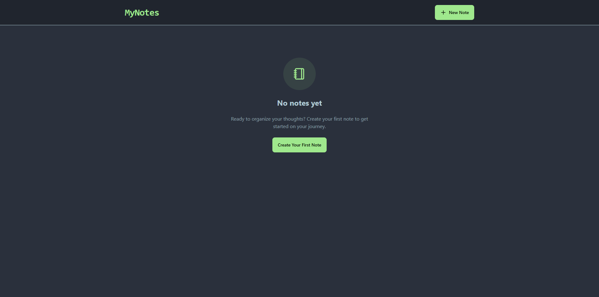

# Create Notes Application
A full 'MERN' stack web application developed on React. User can create, update and delete notes.
   
Tools:
- Frontend: React (HTML, Tailwind CSS, JavaScript)
- Backend: Express, Node.js, MongoDB
- Used React-Hot-Toast for popup dialogs
  
<h3>Screenshots:</h3>

      
         
